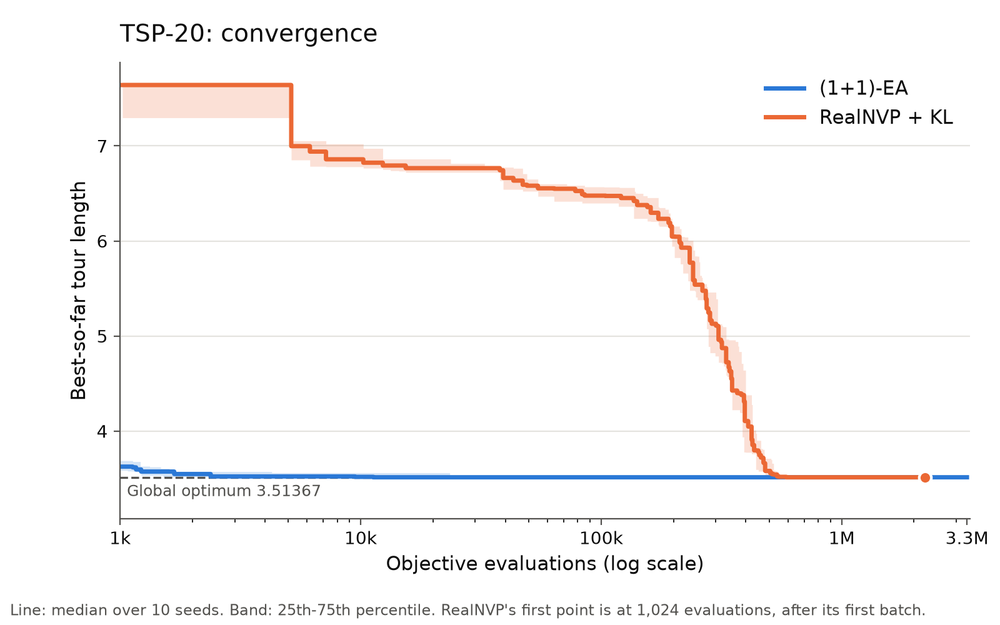
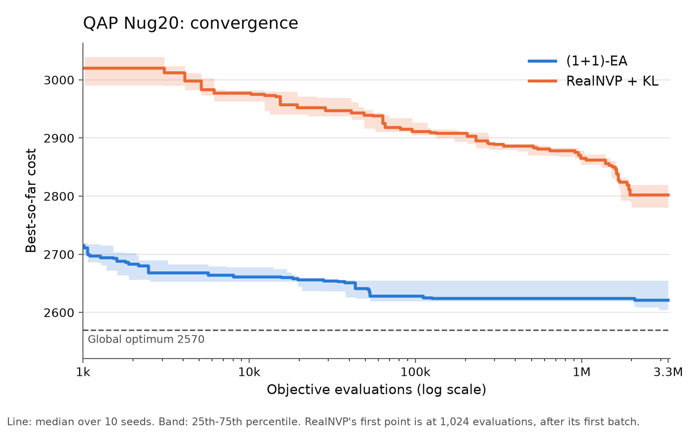
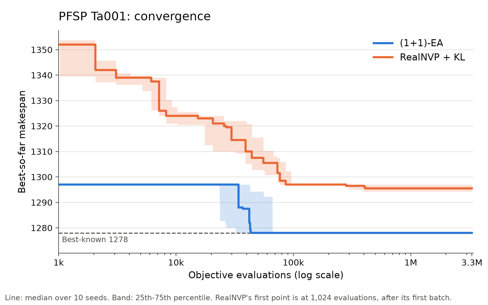
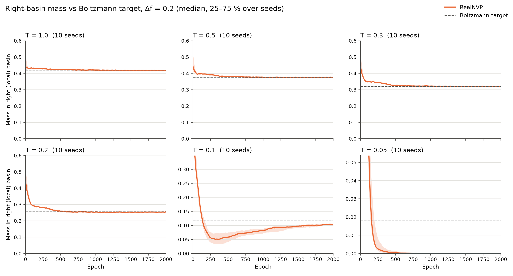
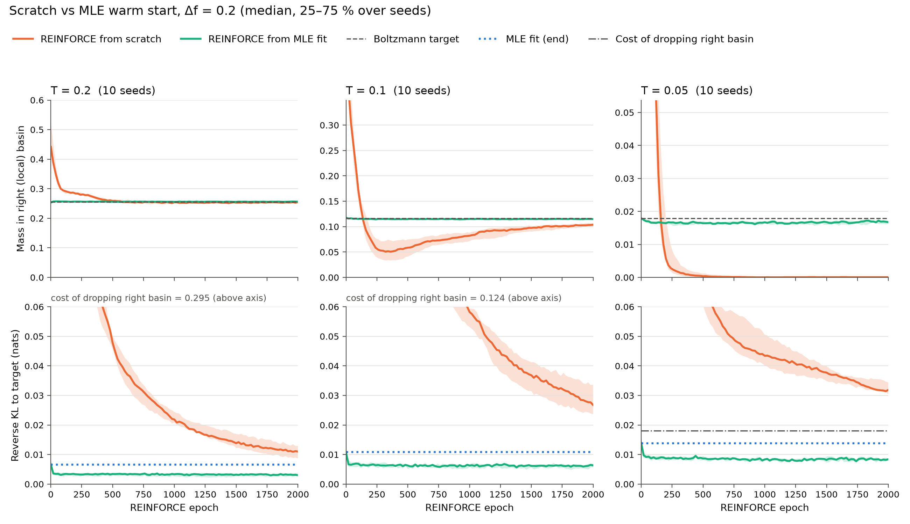

# RealNVP optimization: technical reference

1 October 2026 · Gaber Zupan Škrlj

Detailed part of the handoff: results per problem, protocol, pitfalls and paths in the repository. **Start with the introduction in [`PROJECT_HANDOFF.md`](PROJECT_HANDOFF.md).**

## Summary

The project (September – 1 October 2026) tested whether a RealNVP normalizing flow can be used as a generative black-box optimizer for discrete problems. Idea: instead of searching for an individual solution, we learn a distribution over solutions, sample candidates from it, evaluate them with the objective function and shift the distribution towards better ones. During the work the research question shifted from "can RealNVP optimize?" to "why does it find a good solution but not keep it?".

Course of the work:

1. **Binary benchmark.** Five IOH/PBO problems (n = 100, 100 seeds) and Jump_k against the (1+1)-EA.
2. **Permutation benchmark.** Random-key representation (argsort) on TSP-20, QAP Nug20 and PFSP Ta001 with the same frozen protocol; TSP-50 as a sanity check.
3. **Attempts to fix retention on TSP-20.** Cosine LR + elite, Gaussian exploration, annealed KL (with a clean single-intervention test) and a Boltzmann variant of KL.
4. **Transferring KL to QAP and PFSP**, to check whether the effect is general.
5. **Budget-matched (1+1)-EA** for all three permutation problems and anytime curves (best-so-far vs. number of evaluations).
6. **Control without the flow.** A diagonal Gaussian instead of RealNVP on TSP-20, everything else identical.
7. **2D basin study.** A toy problem with a known Boltzmann target, to separate model capacity from training dynamics: temperatures, MLE fit, warm start and annealing.

## Main results

RealNVP + REINFORCE did not beat the simple (1+1)-EA on any tested problem; the EA reaches an equal or better best-ever on all paired seeds (strictly better: TSP-20 2/10, QAP Nug20 10/10, PFSP Ta001 10/10) and is markedly more sample-efficient.

Main findings:

- **Discovery ≠ retention.** The model often finds the optimum during training, but the final distribution almost never generates it (TSP-20: P(optimum) = 0 on 10/10 seeds with RealNVP + KL).
- **Collapse is not specific to the flow.** A diagonal Gaussian (40 parameters) reaches comparable discovery to RealNVP on TSP-20 (KL: 7/10 vs 8/10 hits); coupling layers showed no measurable advantage under the current protocol. Retention and diversity differ: Gaussian + KL keeps the optimum on 3/10 seeds, RealNVP on 0/10.
- **In the 2D toy problem (T = 0.05) the failure from scratch comes from training dynamics.** The model can allocate mass between both basins, and the two-basin solution has a lower loss; REINFORCE keeps it when it starts from it, but does not reach it from scratch (0/10 seeds). The density shape inside the basins remains capacity-limited.
- **Annealed KL** increases permutation diversity on all three problems, but improves discovery only on TSP-20; on PFSP the improvement did not replicate.
- Transferring the 2D diagnosis to permutation problems is a hypothesis, not a result.

## Main table

Mean best-ever objective over 10 seeds (42–51) and the number of seeds that reach the optimum or best-known value. Lower is better. Where two series of runs exist, both are listed: *saved* = canonical saved run (READMEs in `results/permutation_optimization/`), *trace* = rerun with an anytime trace (`anytime/`).

| Problem (optimum) | RealNVP | RealNVP + KL | Gaussian | Gaussian + KL | (1+1)-EA |
| --- | --- | --- | --- | --- | --- |
| TSP-20 (3.513669) | 3.5865, 3/10 (saved); 3.5786, 4/10 (trace) | 3.5154, 8/10 (clean KL; saved and trace identical) | 3.5198, 3/10 | 3.5163, 7/10 | 3.513669, 10/10 |
| QAP Nug20 (2570) | 2805.8 (9.18 %), 0/10 (saved) | 2794.8 (8.75 %) saved; 2797.2 (8.84 %) trace; 0/10 | not tested | not tested | 2627.6 (2.24 %), 0/10 |
| PFSP Ta001 (1278) | 1295.8 (1.39 %), 0/10 (saved) | 1294.9 (1.32 %), 0/10 (trace, clean baseline + KL) | not tested | not tested | 1278.0 (0.00 %), 10/10 |

- Budget: QAP/PFSP 3,317,760 evaluations for all methods; TSP RealNVP/Gaussian 2,216,960 (2000 epochs), EA 3,317,760, but the EA finds the optimum already after 720–69,742 evaluations (median ~10k).
- Saved vs trace: a rerun is not bit-exact (the number of threads changes float results; same basins, different per-seed numbers). The Gaussian is compared paired with the trace runs and the anytime plots come from the trace runs; the README tables in `results/` use the saved runs. The EA rerun is byte-identical to the saved run.
- Legacy PFSP KL (1293.1) is a different script with different bookkeeping and is not in this table (see the PFSP section).
- Gaussian = diagonal Gaussian random keys, LR tuned (baseline 1e-2, KL 3e-2). The RealNVP LR sweep selects 1e-4 for baseline (= frozen protocol) and 1e-3 for KL (see TSP-20).

## Method and protocol

RealNVP generates a continuous vector, a non-differentiable decoder turns it into a discrete solution, and the gradient goes through REINFORCE on log qθ(y), not through the discretization.

1. z ~ N(0, I) → RealNVP → y (continuous).
2. Decoder: binary threshold, permutations argsort(y) (random keys).
3. Objective on the discrete solution; for minimization reward = −cost.
4. log qθ(y) via `model.inverse(y.detach())`: `gaussian_log_prob(z) + inverse_log_det`.
5. Advantage = reward − leave-one-out baseline, then standardization (equivalent to (r − mean)/std).

$$
\mathcal{L} = -\overline{A \cdot \log q_\theta(y)} + T \cdot \mathrm{KL}, \qquad \mathrm{KL} = \overline{\log \mathcal{N}(z) - \log|\det J_f| - \log \mathcal{N}(y)}
$$

Annealed KL: T geometric 0.1 → 0.001. Architecture: affine coupling (s with tanh, t linear), alternating flip, Gaussian base. No straight-through estimator is used.

**Frozen permutation protocol** (TSP, QAP, PFSP): DIMENSION 20, 4 layers / 64 hidden, batch 1024, 3000 epochs (TSP 2000), Adam LR 1e-4, validation on 4096 samples every 50 epochs, test 16384 samples, grad norm 5.0, seeds 42..51, checkpoint = lowest validation mean.

**Budget:** every objective evaluation counts, including validation ones (they can update best-ever); test ones do not. Wall-clock is not a measure, because runs ran in parallel.

**Metrics:**

- *Discovery:* best-ever, gap, evaluation of the first hit, number of hits.
- *Retention:* final mean and best at the checkpoint (16384 samples), retention_loss = final_best − best_ever.
- *Diversity:* unique permutations / 16384, fraction of samples at the optimum (P(optimum)).

## Binary part (IOH/PBO, completed)

RealNVP + threshold decoder is not better than the (1+1)-EA on any of the five problems, and each problem shows a different failure mode. Setup: n = 100, 100 seeds (42–141), budget 4,096,000 evaluations, higher is better.

| Problem | RealNVP mean best ± std | EA mean best ± std | RealNVP hits | EA hits | Failure mode |
| --- | --- | --- | --- | --- | --- |
| OneMax (100) | 100.0 ± 0.0 | 100.0 ± 0.0 | 100/100 | 100/100 | efficiency: 134,574 vs 1,027 evaluations to the optimum |
| LeadingOnes (100) | 77.3 ± 12.4 | 100.0 ± 0.0 | 1/100 | 100/100 | large variance across seeds, worst 35 |
| ConcatenatedTrap (20) | 16.002 ± 0.020 | 16.35 ± 0.26 | 0/100 | 0/100 | almost deterministic collapse into the deceptive local optimum |
| NKLandscapes | −0.30309 ± 0.00360 | −0.29265 ± 0.00093 | – | – | the average EA run is better than the best RealNVP run |
| IsingTorus (200) | 172.16 ± 7.77 | 195.0 ± 8.70 | 1/100 | 75/100 | RealNVP hit at 406,528, EA on average ~2,660 evaluations |

Source: `results/benchmark_100seeds/README.md`. Older single runs (e.g. LeadingOnes 97/100) are from `results/benchmark/` and are not part of this comparison.

**Jump_k** (n = 100, seed 42, one run per k): finds the optimum up to k = 6 (~240k evaluations), from k = 7 on it collapses to n − k. The hit happens only in a short window (~20 epochs) while the distribution is still wide: the model "outruns" the trap but cannot jump it. The result is one seed per k, so it is only an indication.

## TSP-20

On TSP-20 RealNVP finds the optimum but does not reliably keep it: with the clean baseline and clean RealNVP + KL the final distribution does not generate the optimum on any of the 10 seeds; some older, confounded runs (cosine + elite 3/10, original KL 1/10) occasionally keep it, but retention is not reliable. Instance: Euclidean, instance seed 12345, optimum 3.513669; a common local minimum is 3.522437.

| Variant | Hits | Seeds with P(optimum) > 0 | Unique tours / 16384 | Note |
| --- | --- | --- | --- | --- |
| RealNVP baseline (trace rerun) | 4/10 | 0/10 | 2–8 | saved run 3/10 |
| Cosine LR + elite | 8/10 | 3/10 | – | confounded (8 layers, batch 4096, 3000 epochs, no standardization), retention unstable |
| Gaussian exploration ε = 0 / 0.10 / 0.25 | 4/10, 5/10, 5/10 | – | – | more diversity, no discovery improvement |
| Original KL | 10/10 | 1/10 | – | confounded, same as cosine |
| Baseline + KL only (trace rerun) | 8/10 | 0/10 | 7–20 | all collapse onto 3.522437; saved run 8/10 |
| Boltzmann (KL without standardization) | 9/10 | 0/10 | 53–106 | test mean worse on 10/10 |
| Diagonal Gaussian | 3/10 | 1/10 | 23–748 | σ diverges (537–14040) |
| Diagonal Gaussian + KL | 7/10 | 3/10 | 1–26 | on 3 seeds generator = optimum (99.9 %) |

**Clean KL test.** Baseline + KL only (T 0.1 → 0.001) gives 8/10 vs 3/10 on the saved runs, with a better test mean on 9/10. So KL improves discovery on TSP, but not retention.

**Boltzmann run and effective temperature.** If the advantage is standardized and T · KL is then added, the effective temperature with respect to length is T · std(length), which shrinks as the distribution concentrates. Without standardization (a true Boltzmann target ∝ exp(−length/T)) there are 9/10 hits, but the prediction P(optimum) > 0 is refuted: 0/10, test best 3.522437 everywhere. The flow lags behind the schedule (val mean at epoch 1000: 3.71 vs 3.54).

**Diagonal Gaussian random keys** (y = μ + σ · z, 40 parameters, everything else identical, checked with a diff). Gaussian + KL finds the optimum earlier (122k–160k vs 403k–799k evaluations) and keeps it on 3 seeds, RealNVP on 0. Discovery is comparable; coupling layers showed no measurable advantage under the current protocol. The LR is tuned for both methods with the same rule (RealNVP sweep in the next paragraph).

**RealNVP LR sweep (1 October).** The same sweep as for the Gaussian: `realnvp_tsp20_lr_trace.py`, LR 1e-4 … 1e-2, tuning seeds 0–2, selection by lowest mean best-ever, ties broken by lowest mean test length.

| LR | Baseline: hits, mean best-ever | KL: hits, mean best-ever, mean test length |
| --- | --- | --- |
| 1e-4 | 2/3, 3.5166 (selected) | 3/3, 3.513669, 3.522730 |
| 3e-4 | 1/3, 3.5352 | 3/3, 3.513669, 3.522574 |
| 1e-3 | 0/3, 3.5224 | 3/3, 3.513669, 3.522459 (selected) |
| 3e-3 | 0/3, 3.6158 | 1/3, 3.519515, 3.522504 |
| 1e-2 | 0/3, 4.4815 | 2/3, 3.516592, 3.522825 |

- Baseline: 1e-4 is selected, so the frozen LR is already the best and the existing trace run (4/10) is also the tuned result. Without KL a higher LR does not converge (test mean 4.8 at 3e-3, 8.2 at 1e-2).
- KL: 1e-4, 3e-4 and 1e-3 tie on best-ever; the tie-break selects 1e-3, the differences in test mean are below 0.0003. The KL conclusion rests on the sweep (3 seeds). The KL rows in the tables stay at LR 1e-4.
- P(optimum) = 0 at every LR in both variants. With KL a higher LR only shrinks the distribution further (1e-3: 1–2 unique tours, 1e-4: 9–12). Retention does not depend on the LR.
- On the tuning seeds a tuned RealNVP is even slightly better than a tuned Gaussian (baseline 2/3 vs 0/3, KL 3/3 vs 2/3).

## QAP Nug20 and PFSP Ta001

On QAP and PFSP RealNVP never reaches the optimum; KL consistently increases permutation diversity, but does not reliably improve search quality.

### QAP Nug20 (optimum 2570)

| | Baseline | Annealed KL | KL (trace rerun) |
| --- | --- | --- | --- |
| Mean best cost (gap) | 2805.8 (9.18 %) | 2794.8 (8.75 %) | 2797.2 (8.84 %) |
| Optimum hits | 0/10 | 0/10 | 0/10 |
| Mean final generator cost | 2871.8 | 2838.1 | 2837.5 |
| Mean retention loss | 66.0 | 43.2 | 40.2 |
| Mean unique permutations / 16384 | 4.2 | 11.2 | 11.8 |

- KL has more unique permutations on 10/10 paired seeds, but a better best-ever only on 6/10 (difference 11 at std 34–40, within noise).
- The baseline generator has final best = final mean: all 16384 samples have the same cost.
- RealNVP finds its best-ever late: median 750k evaluations (KL 1.70M).

### PFSP Taillard Ta001 (20 jobs × 5 machines, best-known 1278)

References: NEH 1286, identity 1448.

| | Baseline | Original KL (legacy) | Clean baseline + KL |
| --- | --- | --- | --- |
| Mean best makespan (gap) | 1295.8 (1.39 %) | 1293.1 (1.18 %) | 1294.9 (1.32 %) |
| Best / worst run | 1290 / 1297 | 1288 / 1297 | 1287 / 1297 |
| Hits of 1278 | 0/10 | 0/10 | 0/10 |
| Better than baseline (paired) | – | 8/10 | 5/10 (2 tied, 3 worse) |
| Mean final generator makespan | 1297.003 | 1297.006 | 1297.007 |
| Mean retention loss | 1.2 | 3.9 | 2.1 |
| Mean unique permutations / 16384 | 1550.0 | 13754.4 | 13980.9 |

- **"KL improves PFSP discovery" does not replicate** (std ~3); only permutation diversity replicates.
- All generators end on the 1297 plateau: KL preserves permutation diversity, but not objective diversity. Makespan has large plateaus, so many different permutations get the same objective value; the effect of this on the gradient signal was not measured directly.
- Original KL (`legacy/.../pfsp/realnvp_pfsp_kl.py`) has different bookkeeping (validation does not update best-ever, 61 validations, different CSV schema). The canonical script is `realnvp_pfsp_baseline_kl.py`.

## Budget-matched (1+1)-EA and anytime curves

The EA reaches an equal or better best-ever than RealNVP + KL on all paired seeds and is markedly more sample-efficient. On TSP it reaches the optimum on 10/10 seeds, RealNVP + KL on 8/10 (on those 8 seeds they tie), and the medians of the time to the optimum are ~11k vs ~550k evaluations (~50×). On QAP and PFSP the EA is strictly better on 10/10 seeds. On QAP the EA median at 1k evaluations (2715) is better than the RealNVP median at the end of the budget (2802).

**EA:** current permutation → 1 + Poisson(1) random moves (TSP inversion, QAP swap, PFSP insertion) → full evaluation → accept if not worse (`<=`, because of the PFSP plateaus). Budget 3,317,760 evaluations, seeds 42..51. The fast evaluator is checked against `objective.py` at startup.

- TSP-20: 10/10 hits after 720–69,742 evaluations (median ~10k).
- QAP: 2596–2664, does not find the optimum 2570. After 10k evaluations every EA seed is already better than the RealNVP best-ever after the full budget.
- PFSP: 1278 on 10/10 after 10,665–104,965 evaluations (median ~40k). At 1k evaluations the EA is on the 1297 plateau, where all RealNVP generators end.

Plots: `plotting/clean_anytime_plots.py`, data in `results/permutation_optimization/anytime/`. Line = median over 10 seeds, band = 25th–75th percentile. On the linear y axis the difference 3.522437 vs 3.513669 on TSP is not visible.

## 2D basin study: why the flow loses a basin

In the 2D toy problem RealNVP can allocate mass between several basins; the collapse from scratch at low temperature comes from training dynamics: once a rare basin empties, REINFORCE has no samples there and therefore no signal to return. Problem: two basins, the global one on the left, the right one Δf higher; without T standardized REINFORCE, with T the cost f + T · log q (reverse KL to the Boltzmann distribution ∝ exp(−f/T)). LR 1e-4, 2000 epochs, seeds 42–51, no plateau restore, reported on 100k fresh samples, a basin counts as "occupied" at ≥ 1 % mass. Scripts and commands: `experiments/continuous_optimization/README.md`.

| Step | Setting | Result |
| --- | --- | --- |
| 1 | Δf = 0.2, no T | 10/10 global basin only; the right one drops below 1 % at epoch 100–140 |
| 2 | Δf = 0, no T | 3/10 both, 3 left, 4 right; decided by epoch ~200, an empty basin does not return |
| 3 | Δf = 0.2, T ∈ {1, 0.5, 0.3, 0.2, 0.1, 0.05} | T ≥ 0.2: 10/10 both, p_right/target 0.99–1.00; T = 0.1: 10/10 both, but ratio 0.885 and not converged; T = 0.05: 0/10 |
| 4 | 4 minima, f = 0/0.1/0.2/0.3 | no T: 10/10 global only; with T: all 4 basins 10/10 at every T, TV to target 0.003 (T = 1) … 0.020 (T = 0.1) |
| 5 | T = 0.05: scratch / MLE fit / warm start | scratch 0/10 both; MLE 10/10; warm 10/10 both, KL lower than scratch on 10/10 |
| 6 | Anneal T 0.2 → 0.05 | the basin stays, but below 1 % (0/10); KL lower than scratch on 10/10, higher than warm on 10/10 |

**Step 5 (key control).** At T = 0.05 the target p_right = 0.0179, and dropping the right basin costs 0.018 nats of reverse KL. An MLE fit on exact Boltzmann samples shows that the architecture can represent both basins (forward KL 0.028, converged). REINFORCE starting from the MLE fit (*warm*) keeps both basins on 10/10 seeds: reverse KL 0.0074–0.0099, p_right 0.0148–0.0165. From scratch the reverse KL is 0.029–0.037 and p_right ≤ 0.0003. The collapsed solution is therefore **worse** by the loss, not its optimum; the right basin empties by epoch ~250–500 and does not return.

**Step 6 (anneal, 1 October).** T geometric 0.2 → 0.05 over 1000 epochs, then 1000 at 0.05, paired with scratch. p_right 0.0005–0.0087 (scratch ≤ 0.0003, warm ~0.016), reverse KL 0.021–0.030. Annealing helps partly, but does not reach the warm-start solution.

**Limitations.** Fixed LR 1e-4 and 2000 epochs; at T = 0.2/0.1 scratch has not converged yet (KL 2–4× higher than warm). Mean f is above the target on every seed (+0.003–0.006), so the shape inside a basin is not exact. The spread inside a basin (~0.139) is capacity-limited: tanh on s bounds the log det, so the density has a ceiling.

## Main findings and their scope

Each finding lists its evidence and the limit up to which it holds.

| Finding | Evidence | Holds for | Does not hold / not tested |
| --- | --- | --- | --- |
| RealNVP is not better than the (1+1)-EA | 5 binary problems (100 seeds); TSP/QAP/PFSP: EA equal or better on 10/10 paired seeds (strictly better 2/10, 10/10, 10/10) | all tested problems at n = 100 or 20 | stronger baselines (tabu, iterated greedy) are not needed for this claim |
| Discovery ≠ retention | TSP: P(optimum) = 0 on 10/10 with RealNVP + KL; QAP retention loss 40–66 | TSP-20, QAP, PFSP | Gaussian + KL keeps the optimum on 3/10; confounded RealNVP runs occasionally (cosine 3/10, original KL 1/10) |
| Collapse is not specific to the flow | Gaussian vs RealNVP on TSP-20: 3/10 vs 4/10, 7/10 vs 8/10; LR tuned for both methods | TSP-20 | QAP/PFSP |
| KL increases permutation diversity | more unique permutations on all three problems | TSP, QAP, PFSP | objective diversity (PFSP plateau 1297) |
| KL improves discovery | TSP-20 clean test 8/10 vs 3/10 | TSP-20 | PFSP does not replicate (5/10 paired), QAP within noise |
| Collapse from scratch comes from training dynamics, not from allocation capacity or the optimum of the loss | 2D: warm start keeps both basins with a lower KL, scratch does not | 2D toy, T = 0.05, LR 1e-4 | transfer to permutations is a hypothesis |
| Capacity suffices to distribute mass between basins | MLE fit, steps 3–4 | 2D toy | the shape inside a basin is limited (tanh cap on log det) |

Corrections of common wrong formulations:

- Greater expressiveness was not tested; *lower* expressiveness was tested (Gaussian) and did not hurt.
- "Weak gradient signal" as the cause was not measured. What was measured: without samples in a basin there is no signal to return.
- Redundancy of the random-key representation is plausible, but was not tested as a cause.

## Pitfalls for a successor

The following things are not obvious from the code at first sight and have already led to wrong conclusions or incomparable tables.

- **Wrong estimator in the old toy scripts.** `objective_2d_baseline.py`, `objective_2d_experimental.py`, `objective_2d_test.py` and `objective_10d_baseline.py` use `loss = -(weights * log_det).mean()`, which is not a score-function estimator. The correct one is in `objective_2d_gaussian.py` and `basin_2d_*.py`.
- **Implicit temperature.** A standardized advantage + T · KL is not a fixed Boltzmann target: the effective temperature is T · std(objective) and shrinks with concentration.
- **Confounded TSP runs.** Cosine + elite and original KL differ from the baseline in five things at once (8 layers, batch 4096, 3000 epochs, cosine LR, no standardization). For the KL effect use `realnvp_tsp20_baseline_kl.py`.
- **PFSP KL bookkeeping.** The legacy `realnvp_pfsp_kl.py` does not count validation into best-ever and has a different CSV schema; it is not comparable with the baseline.
- **Reruns are not bit-exact.** The number of threads changes float results (same basins, different per-seed numbers, e.g. QAP up to 72). Always take plots and the numbers next to them from the same run. With parallel seeds set `torch.set_num_threads(...)`.
- **Plateau restore** (checkpoint by lowest mean) can favor a more concentrated distribution. It was therefore switched off in the 2D diagnostics as a possible confounder; it was not ablated as a cause on its own.
- **Retention loss** must be defined the same way everywhere (final_best − best_ever, best-ever includes validation), otherwise tables are not comparable.
- **Environment.** Python is `~/Real-nvp-learning/.venv/bin/python` (the system one has no torch). CUDA on big.ijs.si (Tesla K80, driver 470) does not work with the current PyTorch build; everything runs on CPU. Start long runs with `nohup python -u ... > log 2>&1 &` (without `-u` stdout is buffered).
- **Wall-clock is not a measure.** Runs ran in parallel; compare the number of evaluations.

## Where things are

Everything is in the repository [gaberzupanskrlj/Real-nvp-learning](https://github.com/gaberzupanskrlj/Real-nvp-learning), branch `main`. Scripts are run from their own folder.

Status: **active** = code that produced the results in this document; **results** = CSVs and plots referenced by the READMEs; **documentation**; **legacy** = older or exploratory material that is not part of the conclusions.

| What | Path | Status |
| --- | --- | --- |
| Handoff (introduction / detailed) | `PROJECT_HANDOFF.md`, `PROJECT_HANDOFF_TECHNICAL.md` | documentation |
| Binary benchmark (IOH/PBO, Jump_k) | `experiments/discrete_optimization/benchmarks/binary/{ioh,jump}/` | active |
| Binary results, 100 seeds | `results/benchmark_100seeds/` | results |
| TSP / QAP / PFSP scripts (RealNVP, Gaussian, EA, shared `objective.py`) | `experiments/discrete_optimization/benchmarks/permutation/{tsp,qap,pfsp}/` | active |
| Anytime comparison RealNVP + KL vs EA (trace runs) | `results/permutation_optimization/anytime/` | results (canonical for the EA comparison) |
| Saved permutation runs | `results/permutation_optimization/{tsp20,tsp50,qap,pfsp}/` | results (saved runs) |
| 2D basin study (scripts, CSVs, plots, README) | `experiments/continuous_optimization/basin_2d_*.py` and `basin2d_*` | active + results |
| Plot scripts | `plotting/` | active |
| Summary of 30 September for the mentor | `experiments/README_2026-09-30.md` | documentation |
| Old 2D/10D toy scripts (wrong estimator) | `experiments/continuous_optimization/objective_*.py` | legacy |
| Density estimation (two moons, ring) | `experiments/density_estimation/` | legacy |
| Older exploratory permutation experiments | `experiments/discrete_optimization/legacy/` | legacy |
| Early binary runs, IOH exports, notes | `results/benchmark/`, `results/binary_problems/`, `results/logs/`, `data/`, `notes/` | legacy |

### Key scripts

Scripts write their CSVs next to themselves; the CSVs for the anytime comparison are copied to `results/permutation_optimization/anytime/`.

| Result | Script (in `permutation/` or the 2D folder) |
| --- | --- |
| TSP-20 frozen baseline (saved, 3/10) | `tsp/realnvp_tsp20_baseline.py` (model, one seed), `tsp/realnvp_tsp_10seeds.py` (seeds 42–51) |
| TSP-20 clean baseline + KL (saved, 8/10) | `tsp/realnvp_tsp20_baseline_kl.py` |
| TSP-20 trace reruns (baseline 4/10, KL 8/10) | `tsp/realnvp_tsp20_trace.py baseline\|kl` |
| TSP-20 Boltzmann (KL without standardization) | `tsp/realnvp_tsp20_boltzmann_trace.py` |
| TSP-20 diagonal Gaussian (sweep + main run) | `tsp/gaussian_tsp20_trace.py baseline\|kl sweep\|<LR>` |
| TSP-20 RealNVP LR sweep (1 October) | `tsp/realnvp_tsp20_lr_trace.py baseline\|kl sweep\|<LR>` |
| TSP-20 (1+1)-EA | `tsp/one_plus_one_ea_tsp20.py` |
| QAP baseline / KL / EA | `qap/realnvp_qap_baseline.py`, `qap/realnvp_qap_kl.py`, `qap/one_plus_one_ea_qap.py` |
| PFSP baseline / clean KL / EA | `pfsp/realnvp_pfsp_baseline.py`, `pfsp/realnvp_pfsp_baseline_kl.py`, `pfsp/one_plus_one_ea_pfsp.py` |
| Binary 100-seed benchmark | `binary/ioh/realnvp/*_100seeds.py`, `binary/ioh/baselines/*_100seeds.py` |
| Jump_k | `binary/jump/realnvp_jump_size_sweep.py` |
| 2D basin study, steps 1–6 | `basin_2d_trace.py`, `basin_2d_multi_trace.py`, `basin_2d_mle_fit.py`, `basin_2d_anneal.py` (commands in the 2D README) |
| Anytime plots | `plotting/clean_anytime_plots.py` |

The other scripts in `tsp/` produced older results from the TSP-20 table above or are diagnostic: `realnvp_tsp20_kl.py` (original KL, confounded), `realnvp_tsp20_cosine_elite.py`, `realnvp_tsp_gaussian_exploration*.py`, `realnvp_tsp50_*.py`, `realnvp_tsp_kl_cosine_dual.py`, `simple_tsp_baseline.py` (early TSP-10 sanity check without RealNVP). They are described in `tsp/README.md`; they are not needed to continue.

## Open questions and next steps

The most informative test would be whether the 2D diagnosis (a lost basin without samples has no signal) also holds on permutations. Suggestions by priority:

1. **Warm start or annealing on TSP-20.** Analogue of steps 5–6: start from a distribution that already has mass on the optimum and check whether REINFORCE + KL keeps that mass.
2. **Diagnostics on permutations:** fraction of the batch with distinct objective values, gradient SNR, effective sample size, entropy, time between discovery and loss of the elite solution. This tests the signal hypothesis directly.
3. **CMA-ES over random keys.** Separates the effect of the representation from the way the distribution is learned.
4. **Gaussian on QAP and PFSP**, to extend the claim "collapse is not specific to the flow" beyond TSP-20.
5. **Jump_k with 10 seeds per k** (currently one seed per k).
6. The plot `basin_multi_plots.py` (2D density, 4 minima) waits for a rerun of step 4 with grid snapshots.

Simply adding new architectures or heuristic fixes makes no sense until it is clear whether the bottleneck is the training signal or the representation.
