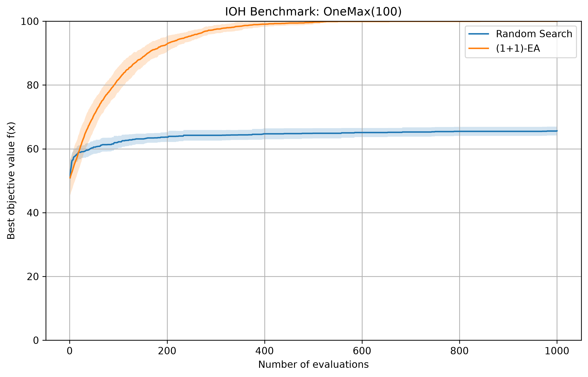

# RealNVP Learning

A small research/learning repository for experimenting with **RealNVP normalizing flows** in PyTorch, from basic density-estimation examples to continuous and discrete optimization.

## Project structure

```text
Real-nvp-learning/
├── experiments/
│   ├── density_estimation/
│   ├── continuous_optimization/
│   └── discrete_optimization/
├── data/
│   ├── ioh/
│   └── ioh_random/
├── results/
│   ├── figures/
│   └── logs/
├── notes/
├── README.md
├── requirements.txt
└── .gitignore
```

## Experiments

### Density estimation
- Ring distribution transformed with RealNVP.
- Historical Two Moons experiment.

### Continuous optimization
- 2D multimodal objective function on a discretized 50×50 grid.
- Uniform and Gaussian base-distribution variants.
- 10D extensions projected to a 2D objective space.
- Baseline and experimental variants kept separately for comparison.

### Discrete optimization
- OneMax with a RealNVP-based search distribution.
- IOHprofiler / IOH benchmark comparison against random search and a simple (1+1)-EA.

## Example result



## Installation

Create a virtual environment and install the dependencies:

```bash
python -m venv .venv
```

On Windows:

```bash
.venv\Scripts\activate
pip install -r requirements.txt
```

On Linux/macOS:

```bash
source .venv/bin/activate
pip install -r requirements.txt
```

## Notes

This repository is experimental and intentionally keeps several baseline and intermediate versions. The directory structure separates the experiments by purpose so that results and IOH data do not clutter the repository root.
