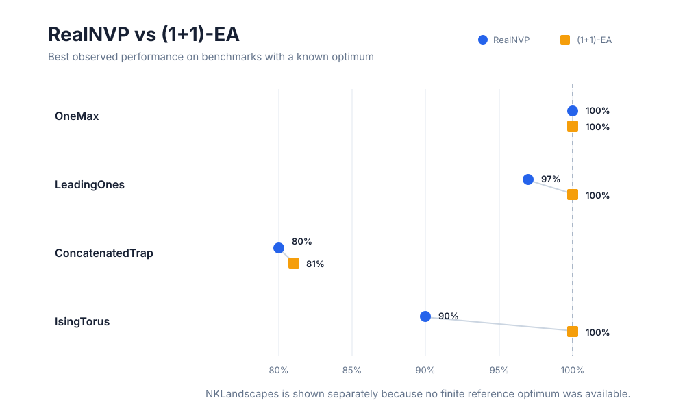
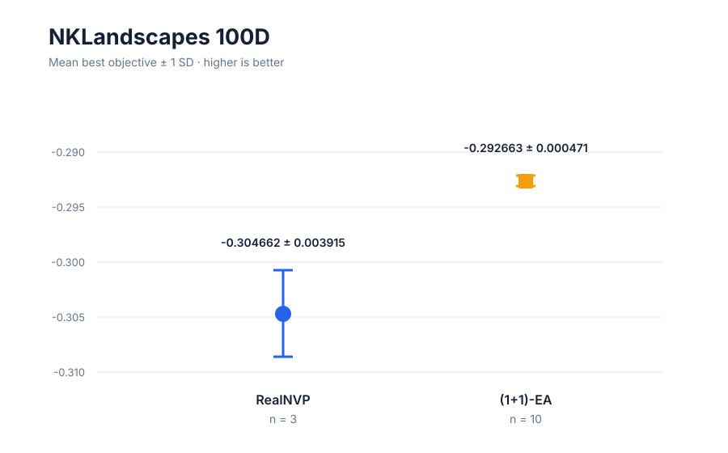
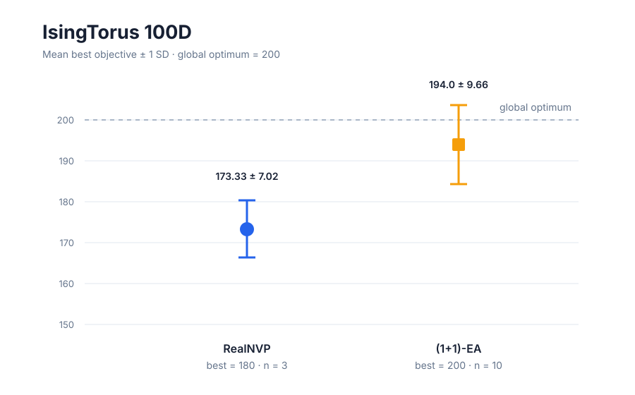

# RealNVP Learning

A research/learning repository for experimenting with **RealNVP normalizing flows** in PyTorch, from density estimation to continuous and discrete black-box optimization.

This branch adds a structured benchmark comparison between a **RealNVP-based discrete optimizer** and a classical **(1+1)-EA**.

## Project structure

```text
Real-nvp-learning/
├── experiments/
│   ├── density_estimation/
│   ├── continuous_optimization/
│   └── discrete_optimization/
│       ├── benchmarks/
│       │   ├── realnvp/
│       │   │   ├── common.py
│       │   │   ├── onemax.py
│       │   │   ├── leading_ones.py
│       │   │   ├── concatenated_trap.py
│       │   │   ├── nk_landscapes.py
│       │   │   └── ising_torus.py
│       │   └── baselines/
│       │       ├── one_plus_one_ea.py
│       │       ├── onemax.py
│       │       ├── leading_ones.py
│       │       ├── concatenated_trap.py
│       │       ├── nk_landscapes.py
│       │       └── ising_torus.py
│       └── legacy/
├── data/
│   ├── ioh/
│   └── ioh_random/
├── results/
│   ├── figures/
│   ├── logs/
│   └── benchmark/
│       ├── figures/
│       ├── benchmark_summary.csv
│       ├── raw_results.md
│       └── README.md
├── plotting/
│   └── plot_benchmark_comparison.py
├── notes/
├── README.md
├── requirements.txt
└── .gitignore
```

## Discrete optimization benchmark

Five 100-dimensional problems are currently included:

- OneMax
- LeadingOnes
- ConcatenatedTrap
- NKLandscapes
- IsingTorus

The cleaned benchmark code is in:

- `experiments/discrete_optimization/benchmarks/realnvp/`
- `experiments/discrete_optimization/benchmarks/baselines/`

Shared algorithm code is kept in one place, while each benchmark problem has a small configuration file. Older exploratory scripts are preserved under `experiments/discrete_optimization/legacy/`.

### Running a benchmark

From the repository root:

```bash
python experiments/discrete_optimization/benchmarks/realnvp/nk_landscapes.py
python experiments/discrete_optimization/benchmarks/baselines/nk_landscapes.py
```

The RealNVP optimizer uses a learned search distribution with a REINFORCE-style objective based on exact RealNVP log-probabilities. The baseline is a standard **(1+1)-EA** with bit mutation probability (1/n).

### Overview



| Problem | RealNVP | (1+1)-EA | Observation |
|---|---:|---:|---|
| OneMax | best 100 / 100 | best 100 / 100 | Both reach the optimum |
| LeadingOnes | best 97 / 100 | best 100 / 100 | EA reaches the optimum more efficiently |
| ConcatenatedTrap | best 16 / 20 | best 16.2 / 20 | Both struggle with deceptive structure |
| NKLandscapes | mean best -0.304662 | mean best -0.292663 | EA is better; higher is better |
| IsingTorus | mean best 173.33 / 200 | mean best 194 / 200 | EA reaches 200 in 7/10 runs |

### NKLandscapes



RealNVP: 3 seeds.  
(1+1)-EA: 10 seeds.

### IsingTorus



The best RealNVP run reached **180 / 200**. The EA reached the global optimum of **200 / 200 in 7 of 10 runs**.

## Current interpretation

The experiments show that RealNVP can learn a strong search distribution on a simple problem such as OneMax. On more structured or rugged landscapes, however, the current setup often concentrates around a suboptimal region and eventually loses reward variance.

The (1+1)-EA performs particularly well when incremental local mutations can preserve already-good structure.

These comparisons are still exploratory. The current benchmark does **not** yet use the same number of independent runs for every algorithm/problem pair, so the results should not be treated as a final statistical study.

For detailed values and recorded runs, see:

- [Benchmark report](results/benchmark/README.md)
- [Raw results](results/benchmark/raw_results.md)
- [Benchmark summary CSV](results/benchmark/benchmark_summary.csv)
- [Benchmark script layout](experiments/discrete_optimization/benchmarks/README.md)
- [Plotting script](plotting/plot_benchmark_comparison.py)

## Other experiments

### Density estimation

- Ring distribution transformed with RealNVP.
- Historical Two Moons experiment.

### Continuous optimization

- 2D multimodal objective on a discretized 50×50 grid.
- Uniform and Gaussian base-distribution variants.
- 10D extensions projected into a 2D objective space.

## Installation

Create a virtual environment:

```bash
python -m venv .venv
```

Windows:

```bash
.venv\Scripts\activate
pip install -r requirements.txt
```

Linux/macOS:

```bash
source .venv/bin/activate
pip install -r requirements.txt
```

## Notes

The repository intentionally keeps older exploratory scripts under `legacy/` so that changes in the RealNVP optimization method remain traceable without cluttering the active benchmark code.
