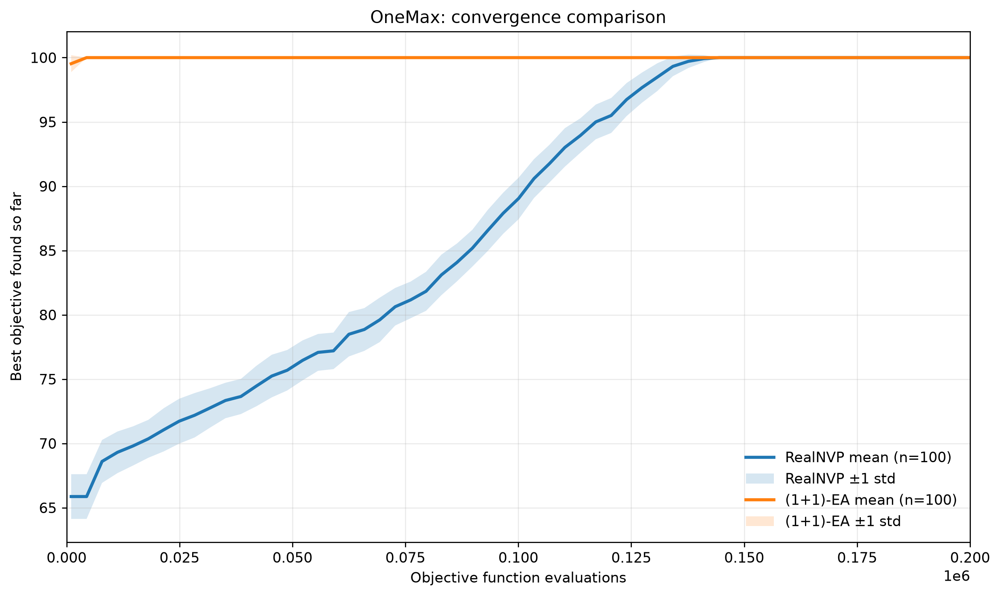
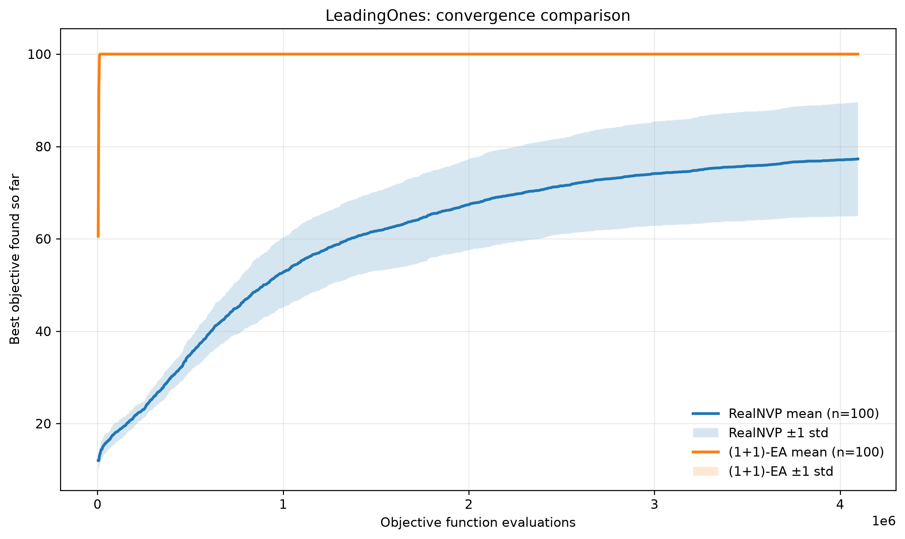
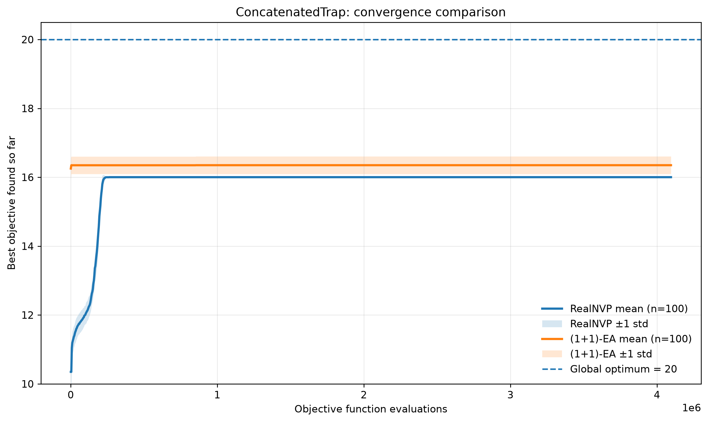
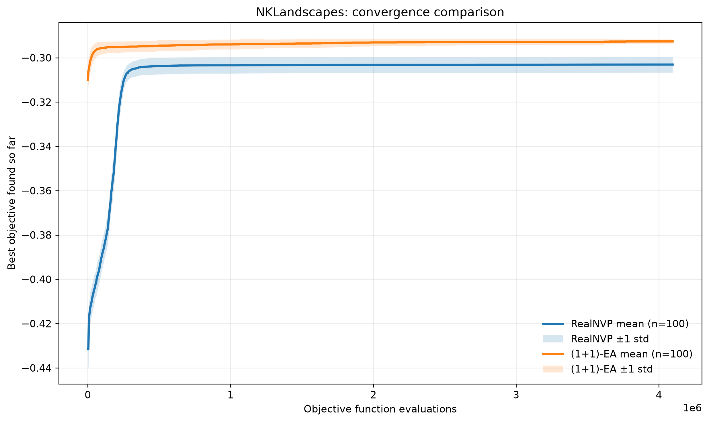
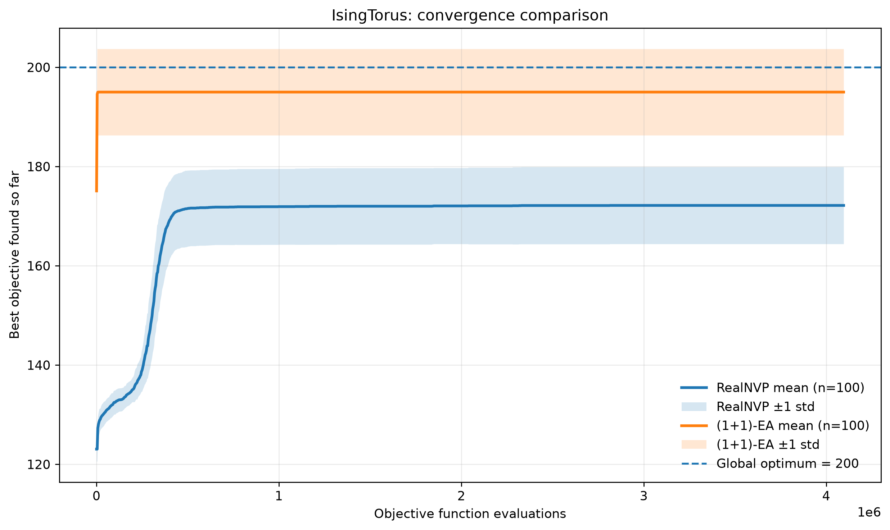

# 100-seed benchmark: RealNVP vs. (1+1)-EA

This directory contains the final statistical comparison between a **RealNVP-based discrete optimizer** and a classical **(1+1)-EA**.

## Experimental protocol

- Problems: OneMax, LeadingOnes, ConcatenatedTrap, NKLandscapes, IsingTorus
- Dimension: 100
- Independent seeds per algorithm/problem: 100
- Seed range: 42-141
- Maximum optimization budget: 4,096,000 objective-function evaluations
- Primary convergence metric: best objective value found so far vs. objective-function evaluations
- Aggregation: mean best-so-far with a ±1 standard deviation band
- RealNVP accounting includes training-batch and validation objective calls
- Final RealNVP test samples are reported separately and are not counted in the optimization budget

This gives **5 problems × 2 algorithms × 100 seeds = 1,000 benchmark runs**.

For known-target problems, the (1+1)-EA stops when it reaches the global target. Because a best-so-far curve cannot improve beyond a known global optimum, the plotting script extends that terminal optimum horizontally to the common evaluation budget. Runs that do not reach the target use the full budget.

## Final summary

Higher objective values are better for all five problems.

| Problem | RealNVP mean best ± std | (1+1)-EA mean best ± std | RealNVP target hits | EA target hits |
|---|---:|---:|---:|---:|
| OneMax | 100.000 ± 0.000 | 100.000 ± 0.000 | 100/100 | 100/100 |
| LeadingOnes | 77.300 ± 12.356 | 100.000 ± 0.000 | 1/100 | 100/100 |
| ConcatenatedTrap | 16.002 ± 0.020 | 16.350 ± 0.256 | 0/100 | 0/100 |
| NKLandscapes | -0.30309 ± 0.00360 | -0.29265 ± 0.00093 | n/a | n/a |
| IsingTorus | 172.160 ± 7.768 | 195.000 ± 8.704 | 1/100 | 75/100 |

Known targets are 100 for OneMax, 100 for LeadingOnes, 20 for ConcatenatedTrap and 200 for IsingTorus. NKLandscapes has no fixed target in this study.

## OneMax

Both algorithms reach the global optimum in all 100 runs, but their sample efficiency differs strongly. RealNVP requires on average **134,574 objective evaluations** to reach 100, while the (1+1)-EA requires **1,027**. OneMax therefore does not expose a reliability problem for RealNVP, but it does expose a large efficiency gap on a simple incremental landscape.



## LeadingOnes

LeadingOnes reveals strong seed-to-seed instability in RealNVP. The final mean is **77.3 ± 12.36**, the worst run ends at 35, and only one of 100 runs reaches the optimum. The (1+1)-EA reaches the optimum consistently.

This behavior is compatible with the structure of LeadingOnes: local mutations can preserve an already-correct prefix, whereas the RealNVP search distribution must learn the relevant dependency structure through a sparse black-box reward signal.



## ConcatenatedTrap

ConcatenatedTrap shows a different RealNVP failure mode. The RealNVP result is **16.002 ± 0.020**, meaning that almost every seed converges to essentially the same deceptive local optimum.

The (1+1)-EA also fails to reach the global target of 20, but its mean is higher at **16.35 ± 0.256** and its larger variance shows that it occasionally reaches better configurations. The important observation is therefore not only that both algorithms struggle, but that RealNVP collapses extremely consistently into the same basin.



## NKLandscapes

Both methods converge quickly and then plateau. The (1+1)-EA is systematically better: its mean final value is **-0.29265** compared with **-0.30309** for RealNVP, and its standard deviation is also substantially smaller.

The average EA run is even better than the best RealNVP run observed in the 100-seed experiment (**-0.29347**), indicating a clear separation rather than a small difference caused by a few lucky seeds.



## IsingTorus

IsingTorus gives the clearest reliability gap. RealNVP reaches the global optimum of 200 in only **1/100** runs, with a mean best value of **172.16**. The (1+1)-EA reaches 200 in **75/100** runs and has a median final value of 200.

Among successful runs, the EA reaches the target after about **2,660 evaluations** on average, while the single successful RealNVP run reaches it at **406,528 evaluations**.



## Overall conclusion

Across these five 100-dimensional benchmarks, the current **RealNVP + REINFORCE + threshold-discretization** setup does not outperform the (1+1)-EA.

The experiments reveal several distinct behaviors rather than one generic failure:

- **OneMax:** reliable but much less sample-efficient.
- **LeadingOnes:** high variance and seed-dependent plateaus.
- **ConcatenatedTrap:** near-deterministic convergence to a deceptive local optimum.
- **NKLandscapes:** stable but systematically lower-quality solutions.
- **IsingTorus:** low probability of reaching the global optimum.

These results should be interpreted as an evaluation of the **current optimizer design**, not as a general claim that normalizing flows cannot be useful for discrete optimization. They provide a clean baseline for future changes such as alternative exploration mechanisms, entropy regularization, different discrete parameterizations, elite/replay strategies, or benchmark families designed around non-local moves.

## Reproducing the benchmark

From the repository root, activate the environment and run a problem-specific RealNVP benchmark:

```bash
source .venv/bin/activate
python -u experiments/discrete_optimization/benchmarks/binary/ioh/realnvp/onemax_100seeds.py
```

Run the matching (1+1)-EA benchmark:

```bash
python -u experiments/discrete_optimization/benchmarks/binary/ioh/baselines/onemax_100seeds.py
```

Replace `onemax` with:

```text
leading_ones
concatenated_trap
nk_landscapes
ising_torus
```

Regenerate all convergence figures with:

```bash
python plotting/plot_100seed_convergence.py
```

The runners save resumable aggregate and per-seed output under `results/benchmark_100seeds/`. Large per-seed traces are intentionally excluded from Git tracking, while aggregate statistics, configuration files, and publication-ready PNG/SVG figures are kept in the repository.

## Runtime note

The main 100-seed runs were executed in parallel for throughput. Their recorded wall-clock times are affected by shared CPU resources and are therefore **not treated as the final runtime comparison**.

A separate timing experiment should use the same hardware, `workers=1`, and identical runtime conditions for both algorithms.
