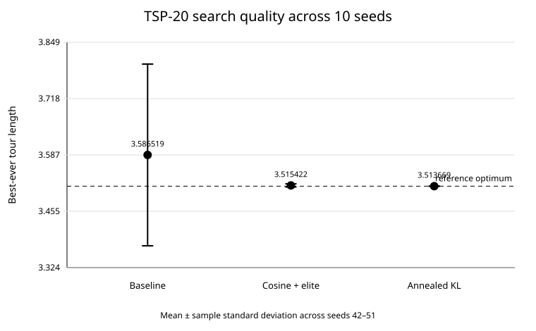
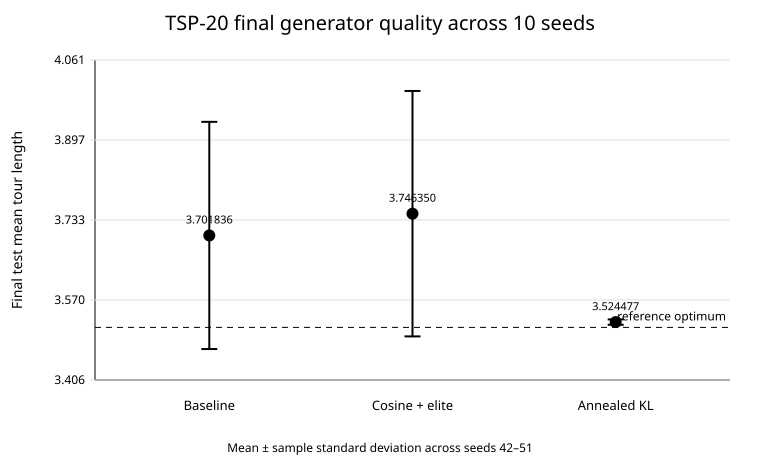

# TSP-20 results

Fixed Euclidean instance:

```text
N_CITIES = 20
TSP_INSTANCE_SEED = 12345
reference optimum = 3.513668846
```

This directory is the main results entry point for the TSP study.

## Search quality

| Metric | RealNVP baseline | Cosine + elite | Annealed KL | Inversion baseline |
|---|---:|---:|---:|---:|
| Seeds | 10 | 10 | 10 | 10 |
| Global optimum hits | 3/10 | 8/10 | **10/10** | 4/10 |
| Mean best length | 3.586519 | 3.515422 | **3.513669** | 3.524057 |
| Std best length | 0.211928 | 0.003697 | ~0.000000 | 0.017981 |
| Median best length | 3.522437 | 3.513669 | 3.513669 | 3.522437 |
| Mean optimality gap | 2.0733% | 0.0499% | ~0.0000% | 0.2956% |

## Learned-generator quality

| Metric | RealNVP baseline | Cosine + elite | Annealed KL |
|---|---:|---:|---:|
| Mean final test mean | 3.701836 | 3.746350 | **3.524477** |
| Std final test mean | 0.232455 | 0.251125 | **0.005491** |
| Median final test mean | 3.583621 | 3.721766 | **3.523876** |
| Final test contains optimum | 0/10 | 3/10 | 1/10 |

Annealed KL is the strongest of the three RealNVP variants for discovery and final-generator stability, but it does **not** solve optimum retention. Nine of ten KL runs end with zero optimal samples in the final test batch and concentrate around the near-optimal tour length `3.522437`. Seed 48 is the exception, with the optimum as the final mode and about 98.96% optimal test samples.

Cosine + elite reaches the optimum in 8/10 runs, but its final generator is much less stable: finding a good tour is not sufficient for the selected checkpoint to generate it reliably.

## Figures





These figures show **10-seed final metrics (mean ± sample standard deviation)**, not convergence trajectories.

A true 10-seed mean±std convergence curve is intentionally not reconstructed here because complete per-epoch histories were not saved for all three completed methods. Reconstructing missing trajectories from final aggregate CSVs would be invalid. The plotting script regenerates the available final-metric figures directly from the stored result summaries.

## Files

- `summary.csv` — method-level best-ever search summary.
- `generator_summary.csv` — final learned-generator summary.
- `comparison_10seeds.csv` — original RealNVP-baseline vs inversion per-seed comparison.
- `cosine_elite/comparison.csv` — exact 10-seed cosine+elite results.
- `annealed_kl/comparison.csv` — exact 10-seed annealed-KL results.
- `figures/` — method-level comparison figures.

## Evaluation note

The frozen RealNVP baseline uses batches of 1024 sampled tours for 2000 epochs. The cosine+elite and annealed-KL experiments use batches of 4096 for 3000 epochs, so the methods do not have identical optimization budgets.

The inversion baseline uses an exact O(1) delta update based on the two boundary edges changed by an inversion. Its evaluation count is a count of candidate moves, not an apples-to-apples count of full black-box objective-function calls.

The current tables should therefore be read primarily as **solution-quality, reliability and learned-generator comparisons**, not as a definitive sample-efficiency ranking.

## Related documentation

- [TSP experiment overview](../../../experiments/discrete_optimization/permutation_optimization/tsp/README.md)
- [Mode-collapse investigation](../../../experiments/discrete_optimization/permutation_optimization/tsp/diagnostics/MODE_COLLAPSE_ANALYSIS_2026-09-23.md)
