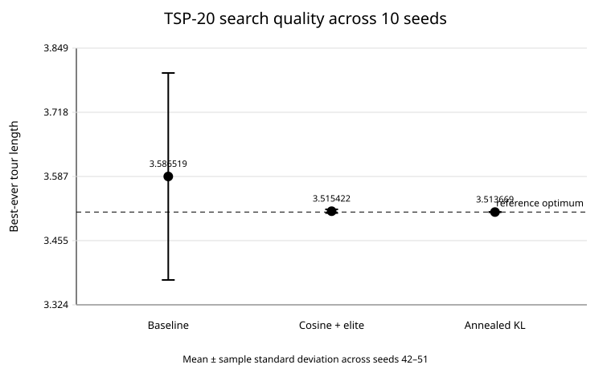
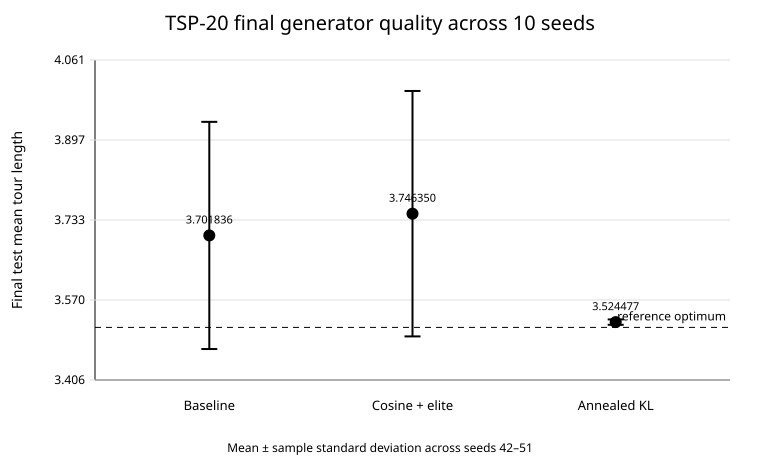

# TSP-20 results

Fixed Euclidean instance:

```text
N_CITIES = 20
TSP_INSTANCE_SEED = 12345
reference optimum = 3.513668846
```

This directory is the main results entry point for the TSP study.

## Which KL result to read

There are two annealed-KL results, and they answer different questions:

- **Clean baseline + KL** is the controlled test: the frozen baseline (4 layers, batch 1024, 2000 epochs) with only the annealed-KL term added. It reaches the optimum in **8/10** runs. This is the number to compare with the baseline (3/10), and it is the one used in the [convergence comparison with the (1+1)-EA](../anytime/).
- **Original KL (confounded)** reaches **10/10**, but it changed several things at once: 8 layers, batch 4096, 3000 epochs, cosine learning rate and no advantage standardisation. Its gain cannot be attributed to KL alone.

Cosine + elite uses the same larger setup as Original KL (8 layers, batch 4096, 3000 epochs, cosine learning rate), without the KL term and with an elite checkpoint.

## Search quality

| Metric | RealNVP baseline | Clean baseline + KL | Cosine + elite | Original KL (confounded) |
|---|---:|---:|---:|---:|
| Layers / batch / epochs | 4 / 1024 / 2000 | 4 / 1024 / 2000 | 8 / 4096 / 3000 | 8 / 4096 / 3000 |
| Seeds | 10 | 10 | 10 | 10 |
| Global optimum hits | 3/10 | 8/10 | 8/10 | 10/10 |
| Mean best length | 3.586519 | 3.515422 | 3.515422 | 3.513669 |
| Std best length | 0.211928 | 0.003697 | 0.003697 | ~0.000000 |
| Median best length | 3.522437 | 3.513669 | 3.513669 | 3.513669 |
| Mean optimality gap | 2.0733% | 0.0499% | 0.0499% | ~0.0000% |

## Learned-generator quality

| Metric | RealNVP baseline | Clean baseline + KL | Cosine + elite | Original KL (confounded) |
|---|---:|---:|---:|---:|
| Mean final test mean | 3.701836 | 3.522905 | 3.746350 | 3.524477 |
| Std final test mean | 0.232455 | 0.000372 | 0.251125 | 0.005491 |
| Median final test mean | 3.583621 | 3.522772 | 3.721766 | 3.523876 |
| Final test contains optimum | 0/10 | 0/10 | 3/10 | 1/10 |

In the clean test, KL alone raises optimum discovery from 3/10 to 8/10 and makes the final generator much more stable, but it does **not** solve optimum retention. All ten clean KL runs end with no optimal samples in the final test batch: the generator concentrates on 7–20 distinct tours around the near-optimal length `3.522437`. The two misses (seeds 45 and 50) stop at that same length. Original KL shows the same pattern: nine of ten runs end on `3.522437`, and only seed 48 keeps the optimum as its final mode.

Cosine + elite reaches the optimum in 8/10 runs, but its final generator is much less stable: finding a good tour is not sufficient for the selected checkpoint to generate it reliably.

## Gaussian exploration ablation

A separate 10-seed sweep tested fixed output-space Gaussian exploration at epsilon `0.00`, `0.10` and `0.25` using the frozen 4-layer, hidden-64, batch-1024 setup.

| Epsilon | Optimum hits | Mean final test mean | Mean final flow uniqueness |
|---:|---:|---:|---:|
| 0.00 | 4/10 | 3.725264 | 0.003320 |
| 0.10 | 5/10 | 3.689891 | 0.024403 |
| 0.25 | 5/10 | 4.129849 | 0.225391 |

Gaussian exploration clearly preserves more flow diversity, but the improvement in optimum discovery is small and high exploration substantially worsens mean generator quality. Both annealed-KL experiments remain stronger on observed search reliability and final-generator quality, although the two experiments do not use matched optimization budgets.

Full per-seed data and aggregate statistics are in [`gaussian_exploration/`](gaussian_exploration/README.md).

## Figures





These figures show **10-seed final metrics (mean ± sample standard deviation)**, not convergence trajectories.

These figures cover the three earlier RealNVP variants only; per-epoch histories were not saved for those runs. Convergence curves (best-so-far vs objective evaluations) for the clean baseline + KL run against the (1+1)-EA are in [`../anytime/`](../anytime/).

## Files

- `summary.csv` — method-level best-ever search summary.
- `generator_summary.csv` — final learned-generator summary.
- `comparison_10seeds.csv` — RealNVP-baseline per-seed results (the `inversion_*` columns are from the removed single-inversion local search).
- `cosine_elite/comparison.csv` — exact 10-seed cosine+elite results.
- `annealed_kl/comparison.csv` — exact 10-seed Original KL (confounded) results.
- `../anytime/tsp20_realnvp_kl_10seeds.csv` and `../anytime/tsp20_realnvp_kl_trace.csv` — clean baseline + KL results and best-so-far trace.
- `gaussian_exploration/` — completed Gaussian-exploration ablation with per-seed and aggregate results.
- `figures/` — method-level comparison figures.

## Evaluation note

The frozen RealNVP baseline and the clean baseline + KL run use batches of 1024 sampled tours for 2000 epochs. The cosine+elite and Original KL experiments use batches of 4096 for 3000 epochs, so those two do not have the same optimization budget as the baseline.

An earlier single-inversion local search (4/10) is no longer part of the active comparison. It counted candidate moves with an O(1) delta update rather than full objective evaluations, and it stalled in a 2-opt local optimum within about 1,000 evaluations on every seed. The budget-matched (1+1)-EA in [`../anytime/`](../anytime/) replaces it as the classical baseline.

The tables should therefore be read primarily as **solution-quality, reliability and learned-generator comparisons**. For sample efficiency, see the evaluation-matched convergence comparison in [`../anytime/`](../anytime/).

## Related documentation

- [TSP experiment overview](../../../experiments/discrete_optimization/benchmarks/permutation/tsp/README.md)
- [Mode-collapse investigation](../../../experiments/discrete_optimization/legacy/permutation_optimization_old/tsp/diagnostics/MODE_COLLAPSE_ANALYSIS_2026-09-23.md)
